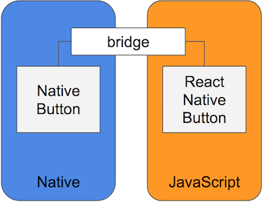

# React Native 러닝 가이드

JavaScript + React → Native App(iOS, Android) 😍

 

## React Native

React Native는 웹 개발자에게 네이티브 앱을 개발할 수 있는 길을 열어주었습니다.
 **Learn Once, Write Anywhere!**

 

### React 개발 경험

React Native는 React 앱 개발 방식을 그대로 네이티브 개발에 사용할 수 있습니다. 
React를 사용했다면 네이티브 앱도 제작할 수 있습니다.

- 뷰 캡슐화 | View Encapsulation
- 관심사의 분리 | Separation of Concern
- 모듈러 프로그래밍 | Modular
- JSX | JavaScript + XML

 

### React Native 특징

React Native는 브리지(Bridge)를 사용해 
JavaScript와 Native 사이에서 인터랙션 할 수 있도록 만들어 줍니다.

* 크로스 플랫폼 (웹 / 모바일)
* 웹의 장점을 사용해 모바일 개발
* Native 모듈 ⇔ 브리지 ⇔ JavaScript 모듈

 

 
 

### 기본 UI 컴포넌트

React Native는 웹이 아닌, 네이티브 앱용 기본 UI 컴포넌트를 제공합니다.
웹 UI 요소는 사용할 수 없습니다. 웹 UI 요소에 매칭되는 기본 UI 컴포넌트를 제공합니다.

React Native | Web
--- | ---
\<View\> | \<div\>
\<Text\> | \<h1\> ~ \<h6\>, \<p\> 등
\<TextInput\> | \<input\>
\<TouchableOpacity\> | \<button\>, \<input type="button"\> 등

 

### ✏ 학습

[React Native 러닝 가이드](https://yamoo9.github.io/react-native/guidebook/rn-react-native.html)를 참고하여 학습을 진행합니다.

1. React Native 프레임워크
1. React Native 작동 구조
1. Expo 서비스
1. React Native CLI
1. Android 개발 환경
1. iOS 개발 환경 (Mac)
1. React vs React Native
1. 컴포넌트 / API
1. 전달 속성 / 상태
1. 스타일 / 크기 및 치수
1. Flexbox 레이아웃
1. TextInput 컨트롤
1. 디버깅 (오류 처리)
1. 플랫폼 별 스타일링
1. 디렉토리 구조
1. 스크롤 뷰
1. 리스트 뷰
1. 터치 컨트롤
1. 네트워킹
1. 이미지 컨트롤
1. 벡터 아이콘