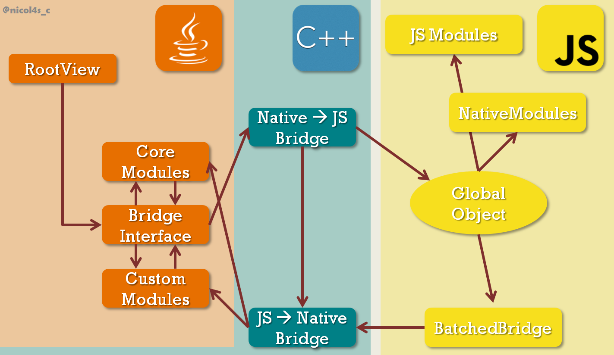
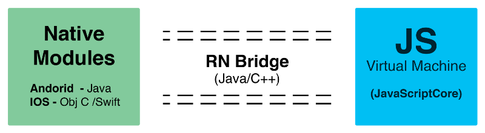
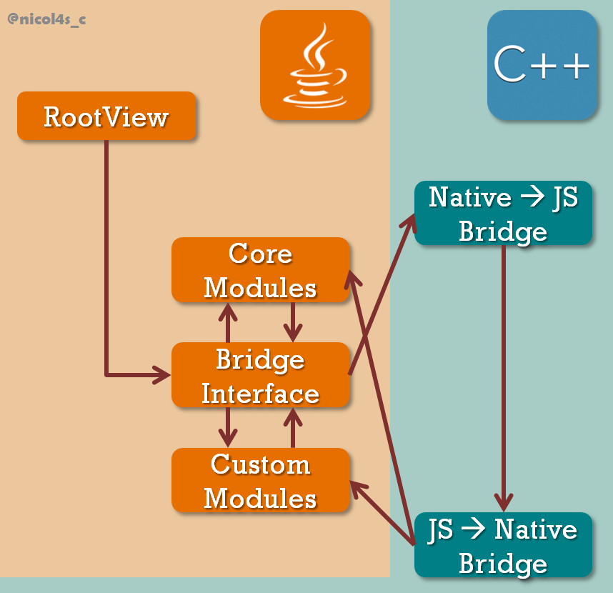
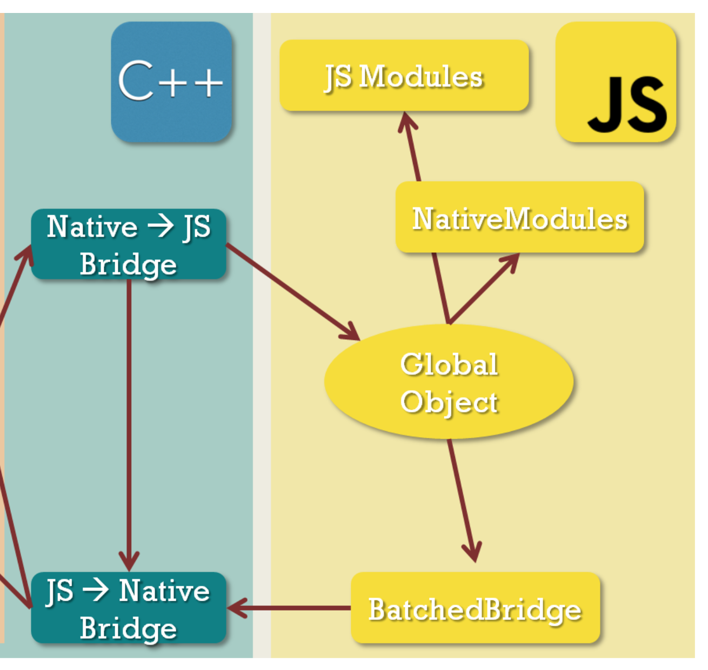

# React Native 러닝 가이드

JavaScript + React → Native App(iOS, Android) 😍

<br>

## React Native

React Native는 웹 개발자에게 네이티브 앱을 개발할 수 있는 길을 열어주었습니다.
<br>**Learn Once, Write Anywhere!**


<br>

### React 개발 경험

React Native는 React 앱 개발 방식을 그대로 네이티브 개발에 사용할 수 있습니다.<br>
React를 사용했다면 네이티브 앱도 제작할 수 있습니다.

- 뷰 캡슐화 | View Encapsulation
- 관심사의 분리 | Separation of Concern
- 모듈러 프로그래밍 | Modular
- JSX | JavaScript + XML

<br>

### React Native 특징

React Native는 브리지(Bridge)를 사용해<br>
JavaScript와 Native 사이에서 인터랙션 할 수 있도록 만들어 줍니다.

* 크로스 플랫폼 (웹 / 모바일)
* 웹의 장점을 사용해 모바일 개발
* Native 모듈 ⇔ 브리지 ⇔ JavaScript 모듈

<br>


<br>
<br>

### 기본 UI 컴포넌트


React Native | Web
--- | ---
\<View\> | \<div\>
\<Text\> | \<h1\> ~ \<h6\>, \<p\> 등
\<TextInput\> | \<input\>
\<TouchableOpacity\> | \<button\>, \<input type="button"\> 등

<br>

### ✏ 학습

[React Native 러닝 가이드](https://yamoo9.github.io/react-native/guidebook/rn-react-native.html)를 참고하여 학습을 진행합니다.

1. React Native 프레임워크
1. Expo 서비스
1. React Native CLI
1. Android 개발 환경
1. iOS 개발 환경 (Mac)
1. React vs React Native
1. 컴포넌트 / API
1. 전달 속성 / 상태
1. 스타일 / 크기 및 치수
1. Flexbox 레이아웃
1. TextInput 컨트롤
1. 디버깅 (오류 처리)
1. 플랫폼 별 스타일링
1. 디렉토리 구조
1. 스크롤 뷰
1. 리스트 뷰
1. 터치 컨트롤
1. 네트워킹
1. 이미지 컨트롤
1. 벡터 아이콘

<br>

> 아래 글은 React Native가 어떻게 동작하는지 궁금한 분들에게 도움이 됩니다. <br>
> 어떻게 JavaScript와 Native가 인터랙션 가능한가?에 대한 궁금증이 없다면 읽지 않아도 무방합니다.

<br>

### React Native 작동 구조

React Native로 작성한 앱이 네이티브 앱으로 작동 가능한 이유는 React Native 인프라스트럭처(Infrastructure) 위에서 동작 하기 때문입니다.
인프라스트럭처는 어떤 커스텀 코드가 실행되기 전에 앱을 실행 할 때 마다 빌드됩니다. 즉, React Native가 앱 기반을 구축하기 위한 배경 작업이 바쁘게 이루어지게 됩니다.

다음 그림은 인프라스트럭처 구조를 보여줍니다. 왼편의 JAVA 로고는 Android 네이티브 개발 환경을 보여주며, iOS의 경우 Objective-C로 변경될 수 있습니다.
다소 복잡해 보이는 프로세스를 거쳐 JavaScript로 개발된 코드가 네이티브 앱에서 작동 가능한 코드로 변경됩니다.



### React Native 앱 시작 → 빌드

인프라스트럭처는 React Native 앱이 시작될 때마다 빌드 됩니다.
일반적으로 앱을 구동하려면 다음 2가지가 필요합니다.

- 애플리케이션 코드
- 모바일 OS에 의해 할당 받는 고유 스레드 인 **메인 스레드(또는 UI 스레드)**

<br>

인프라스트럭처의 빌드 코드를 쉽게 이해하기 위해 개념적으로 코드를 다음과 같이 분류할 수 있습니다.

- **프레임 워크 코드** → 매번 작성하지 않아도 되는 코드
- **커스텀 코드** → 개발자가 작성하는 코드

<br>

그리고 프레임 워크, 커스텀 코드는 각각 JavaScript 코드와 Native 코드로 나눌 수 있어 총 4부분으로 분류할 수 있습니다.

- **프레임 워크 코드**
  - JavaScript 코드
  - Native 코드
- **커스텀 코드**
  - JavaScript 코드
  - Native 코드

<!-- 메인 스레드에서 먼저 처리되는 것은 프레임 워크의 Native 코드 부분입니다. -->

<br>

### Native 기반 형성

React Native로 작성하는 UI 코드는 JavaScript를 사용하지만, 최종적으로는 Native View로 렌더링 됩니다.
즉, React Native는 Native View로 렌더링 하기 위해 다음의 2가지를 수행해야 합니다.

- Native View를 만들고 JavaScript 컴포넌트와 연결
- 생성한 Native View를 저장하고 앱 화면에 렌더링

<br>

첫번째 단계가 UIManagerModule에 의해 다뤄지는 동안, RootView는 두번째 단계를 처리합니다.
RootView는 Native View를 구성되는 컨테이너(JavaScript 컴포넌트의 Native 표현 방식) 역할을 말합니다.
앱 화면에 표시되는 모든 것은 RootView 안에 포함됩니다.

초기화 단계에서 모든 것은 브리지 인터페이스(Bridge Interface)로 이동하기 전에 RootView에서 시작합니다.
RootView를 포함한 대부분의 Native 코드는 특정 플랫폼에 맞는 언어(JAVA, Objective-C)로 작성되어 있어도
브리지는 전부 C++로 구현화 되어 있습니다. 그래서 브리지 인터페이스는 Native와 JavaScript가
서로 인터랙션 할 수 있도록 "다리(Bridge)" 역할을 합니다.



브리지 자체는 2개의 엔드 포인트를 가집니다. 하나는 'JavaScript ➪ Native', 다른 하나는 'Native ➪ JavaScript' 입니다.
하지만 디스패치(dispatch) 호출을 할 수 있는 엔드 포인트가 없다면 브리지는 아무런 의미가 없습니다. 즉, Native 모듈을 제외한 모든 것은
결국 애플리케이션에서 보이지 않게 됩니다.

#### UIManagerModule

이런 이유로 프레임 워크 코드에는 핵심 모듈(Core Modules)이 포함되어 있습니다. 핵심 모듈 중 한가지는 UIManagerModule 입니다.
UIManagerModule은 JavaScript로 구성된 모든 UI 컴포넌트와 연관된 Native View 와의 매핑 정보를 저장합니다. 예를 들어
JavaScript로 작성된 UI 컴포넌트가 생성 되거나, 업데이트 되거나, 제거 될 때마다 UIManagerModule에 저장된 매핑 정보를 이용해
Native View를 생성 하거나, 업데이트 하거나, 제거 합니다. 그리고 앱 화면을 렌더링 하기 위해 변경 사항을 RootView에 저장된
Native View 트리에 전달합니다.

초기화 관점에서 보면 모든 Native 모듈은 동일하게 처리됩니다. 각 모듈은 인스턴스를 만들고 인스턴스에 대한 레퍼런스가 JavaScript에서
Native 브리지에 저장되고, 추후 JavaScript에 의해 호출될 수 있습니다. 그리고 브리지 인터페이스에 대한 레퍼런스가 각 Native 모듈에
전달 될 수 있어 직접 JavaScript를 호출할 수도 있습니다.
최종적으로 2개의 추가 스레드가 생성됩니다. 하나는 JavaScript 스레드, 다른 하나는 Native 모듈 스레드 입니다.

<br>

### JavaScript 엔진 설정

앞서 설명한 내용을 간단히 요약하면 다음과 같습니다.

- 메인 스레드는 Native와 관련된 것을 생성
- 3개의 스레드를 이용
- 아직 JavaScript는 처리 ✘

<br>

현재까지의 과정을 보여주는 이미지 맵은 이 부분입니다.




Native 앱 환경에서 JavaScript로 작성된 코드를 그대로 실행할 수 없습니다. 바이트 코드로 변환한 후에야
실행 가능합니다. 코드 변환 과정은 JavaScript 가상머신(VM, Virtual Machine)에 의해 처리됩니다.

JavaScript 엔진은 Chrome V8, Safari JavaScript Core 등등 다양합니다. iOS 앱에서는
Safari JavaScript Core를, 하지만 Android 앱에는 Safari JavaScript Core가 포함되어 있지 않아
React Native는 번들링 과정에서 JS Core 복사본을 포함합니다. 그것이 React Native로 만든
Android 앱이 iOS 앱보다 다소 무거운 이유입니다.

React Native는 JavaScript 엔진을 효과적으로 실행하기 위해 실행 환경에 대한 컨텍스트(Context)를
제공해야 합니다. 즉, JavaScript 글로벌(Global) 객체를 포함해야 하고, 사실상 C++ 브리지에 생성되고
저장됩니다. 이것은 매우 중요한 과정인데 글로벌 객체는 JavaScript 환경 뿐만 아니라, 외부에서도 접근
가능하기 때문입니다.

글로벌 객체는 C++(Native)와 JavaScript 간의 기본적인 통신 수단이며, JavaScript에서 Native로 전달 하는데 사용되는 모든 기능은
글로벌 객체를 통해 이루어집니다. 글로벌 객체에는 많은 것이 담겨있지만, ModuleConfig 배열과 flushQueue() 함수는 특별해 더욱 중요합니다.

ModuleConfig 배열의 각 아이템은 Native 모듈(코어 또는 커스텀)에 대한 정보를 기술하며 이름, 외부로 노출되는 상수, 함수 등을 포함합니다.
flushQueue() 함수는 JavaScript와 Native 환경 간 통신을 보장하게 해주는 중요한 역할을 수행하며, 주기적으로 호출 과정에 사용됩니다.

JavaScript 컨텍스트가 완전히 생성되고 채워지면, JavaScript 엔진으로 보내집니다. 그리고 JavaScript 스레드에서
React Native JavaScript 번들 로딩을 시도합니다.

<br>

### JavaScript 번들 로딩

JavaScript VM이 프레임 워크의 JavaScript 부분을 처리하기 시작하면 BatchedBridge를 생성합니다. BatchedBridge는
단순한 큐(Queue)에 불과하며 'JavaScript에서 Native 호출을 저장'하는 역할을 수행합니다.

'호출'이란? Native 모듈 ID,
메서드 ID, 그리고 인자를 포함하는 객체입니다. BatchedBridge는 약 5ms 마다 주기적으로 global.flushQueue()를 호출하는데
콘텐츠('호출' 배열)를 JavaScript에서 C++ 브리지(Native)로 보냅니다.

batch로 불리는 이 작은 배열은 모든 UI 변경 사항을
동시에 표시하도록 인덱싱 되어 있습니다. 전체 프로세스가 비동기 이기 때문입니다.
브리지의 Native 엔드에 대한 JavaScript가 일괄적으로 각 호출에 걸쳐 반복되며, 특정 모듈 ID를 이용해 적절한 Native 모듈에
디스패치 합니다.

다음 단계는 NativeModules 객체를 만드는 것입니다. 이 단계는 Native를 호출할 때마다 React Native로부터 추가되어야 하는 객체를 생성합니다.
NativeModules 객체는 앞서 언급한 ModuleConfig 배열을 이용해 채워집니다. 이 과정은 대체적으로 ModuleConfig 안에 포함된 각 module_name에 대해
아래와 같이 처리하고,

```js
NativeModules[module_name] = {}
```

그리고 각 모듈로부터 외부로 노출된 Native 메서드에 대해서는 다음과 같이 처리하는 것과 동일합니다.

```js
NativeModules[module_name][method_name] = fillterMethod
```

fillterMethod는 BatchedBridge에서 받은 모든 인수를 저장하기 위해 존재하며 메서드 및 모듈 ID를 포함합니다.

```js
fillterMethod = function(...args) {
  BatchedBridge.enqueueNativeCall(moduleID, methodID, args)
}
```

이러한 방법을 사용해 JavaScript에서 Native로 가는 '호출'을 효과적으로 생성하도록 합니다. 그래서 추후
`MyNativeModule.myMethod(args)`를 작성하는 것은 실제로 fillterMethod 입니다.

마지막은 JavaScript Core 모듈을 만드는 것입니다. Core 모듈은 이벤트를 Native에서 JavaScript로
보내주는 데 사용되는 DeviceEventEmitter와 앱의 메인 컴포넌트에 대한 레퍼런스 정보를 저장하는 AppRegistry를
포함하고 있습니다. Native에서 호출 가능하게 하기 위해 이 모듈들은 JavaScript 글로벌 객체에 등록 됩니다.
이것으로 완전하게 React Native 인프라스트럭처는 완성됩니다.



<br>

## React Native 앱을 화면에 렌더링

초기화를 완료했음에도 아직 이 단계에서는 앱이 화면 상에 렌더링 되지 않습니다. 사실 JavaScript 번들을 로딩하는 것은
JavaScript 스레드에서 일어나는데 이는 메인 스레드(UI 스레드)와는 독립적입니다. 그래서 JavaScript 스레드는 프로세스가
완료되었음을 메인 스레드에 알려주고, 그에 대한 반응으로 메인 스레드는 AppRegistry(JS Module)를 사용해서 JavaScript 스레드가
메인 커스텀 컴포넌트(일반적으로 App.js)를 처리하도록 요청합니다.

스레드 관점에서 요약하면 React Native 앱의 실행 과정은 다음과 같습니다.


앱의 메인 컴포넌트를 포함하는 JavaScript 컴포넌트 트리를 순환 하면서 UI 컴포넌트를 만날 때마다
UIManagerModule을 호출하게 됩니다. UI 스레드에서 UIManagerModule은 Native View를 만들고
이를 RootView에 저장합니다. 이제 앱이 화면에 렌더링 됩니다. 🎉

<br>

## 정리

React Native에 의해 브리지 될 필요가 있는 갭은 2가지 입니다.

- 언어 갭(Native, JavaScript)
- 스레드 갭(메인 스레드, NativeModules 스레드, JavaScript 스레드)

Native, JavaScript 간의 언어 문제는 C++ 환경에서 모두 접근 가능한 JavaScript 글로벌 객체를 가지고 처리합니다.
결과적으로 React Native에서 '브리지'를 호출하는 것은 서로 다른 스레드로 일을 디스패치 하는 걸 처리하기 위해서 필요할 뿐입니다.

그런 점에서 'Navtive에서 JavaScript로', 'JavaScript에서 Native로' 라는 이름은 모두 동일한 언어로 구현되었지만 완벽한 의미를 갖습니다.
첫번째 스레드는 메인 스레드(또는 NativeModule 스레드)에서 호출 되어 JavaScript 스레드로 전달합니다. 두번째 스레드는
JavaScript 스레드(global.flushQueue()함수 사용)에서 호출 되고 호출을 Native 스레드로 디스패치 합니다.

<br>

## 참고

Nicolas Couvrat가 작성한 [Wait… What Happens When my React Native Application Starts? — An In-depth Look Inside React Native](http://bit.ly/2HVUQRL) 원문 글을 읽어보세요.