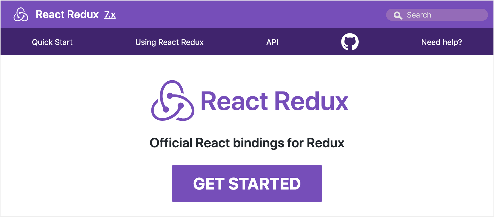
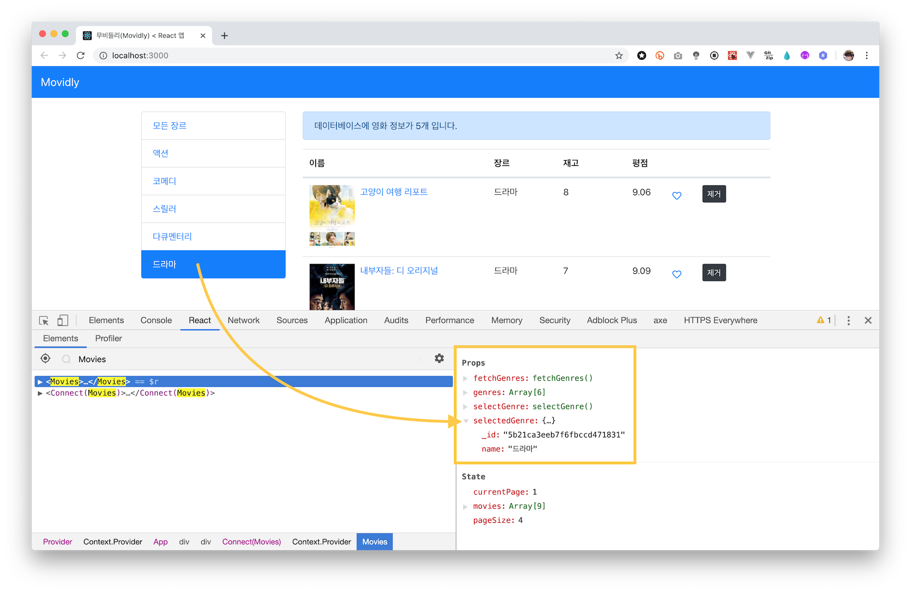

# React Native 러닝 가이드

JavaScript + React → Native App(iOS, Android) 😍

### 🤐 학습 자료

React + Styled Components 애플리케이션 학습 자료를 다운로드 받아 실습을 진행합니다.

➪ [학습 자료](https://github.com/yamoo9/react-native/archive/styled-components-end.zip) 다운로드

<br>

## Redux / React Redux 라이브러리

[Redux](https://redux.js.org/), [React Redux](https://react-redux.js.org/) 라이브러리는 React 애플리케이션의 상태를 관리하기 위한 견고하고 안정적인 솔루션을 제공합니다. 여기 저기 혼란스럽게 흩어져 있는 상태를 체계화 하여 애플리케이션을 관리하도록 도와줍니다.



### ✏ 학습

[Redux 러닝 가이드](https://yamoo9.github.io/react-native/guidebook/rd-redux.html)를 참고하여 학습을 진행합니다.

1. Redux 라이브러리
1. 리듀서 함수
1. Redux 설치/활용
1. Redux 패턴 리뷰
1. Redux 앱 + Redux
1. 불변 데이터 관리

<br>

## ✏ 실습

### 라이브러리 설치

프로젝트레 Redux, React Redux 라이브러리를 설치합니다.

```sh
$ yarn add redux react-redux
# 또는 npm i redux react-redux
```

### 장르(Genre) 상태 관리

Movies 컴포넌트가 소유한 상태 중, `genres`, `selectedGenre`를 스토어에서 관리하도록 설정합니다.

```js
// src/components/Movies.jsx

state = {
  movies: [],
  genres: [],
  selectedGenre: null,
  currentPage: 1,
  pageSize: 4,
}
```

#### 스토어 디렉토리

src 디렉토리 내부에 store 디렉토리를 생성한 후, 다음과 같이 리듀서, 액션을 구성합니다.

```sh
src/store/ # 스토어 관리 디렉토리
├── actions/ # 액션 관리 디렉토리
│   ├── actionTypes.js # 액션 타입
│   └── genres.js # 장르 액션
├── index.js # 스토어 생성 (루트 리듀서 설정)
└── reducers/ # 리듀서 관리 디렉토리
    ├── genres.js # 장르 리듀서
    └── index.js # 루트 리듀서
```

#### 액션 설정: 장르

'장르 추가', '장르 선택' 액션을 설정해봅니다.

```js
// src/store/actions/actionTypes.js

export const ADD_GENRES = 'ADD_GENRES'
export const SELECT_GENRE = 'SELECT_GENRE'
```

```js
// src/store/actions/genres.js

import { ADD_GENRES, SELECT_GENRE } from './actionTypes'

// 장르(배열) 추가 액션
// - '장르 추가' 요청(dispatch)이 감지되면 ADD_GENRES 액션 반환
export const addGenresAction = genres => {
  return { type: ADD_GENRES, genres }
}

// 장르 선택 액션
// - '장르 선택' 요청(dispatch)이 감지되면 SELECT_GENRE 액션 반환
export const selectGenreAction = selectedGenre => {
  return { type: SELECT_GENRE, selectedGenre }
}
```

#### 리듀서 설정

컴포넌트로부터 '장르 추가', '장르 선택' 액션이 디스패치 되면 액션 타입을 감지해 처리할 리듀서(함수)를 작성합니다.

```js
// src/store/reducers/genres.js

import { ADD_GENRES, SELECT_GENRE } from '../actions/actionTypes'

// 초기 상태(데이터)
const initState = {
  selectedGenre: null,
  data: [],
}

// 리듀서
export default (state = initState, action) => {
  switch (action.type) {
    // '장르 추가' 요청 시, 처리
    case ADD_GENRES:
      return { ...state, data: [...state.data, ...action.genres] }
    // '장르 선택' 요청 시, 처리
    case SELECT_GENRE:
      return { ...state, selectedGenre: action.selectedGenre }
    default:
      return state
  }
}
```

#### 루트 리듀서

장르(genres) 상태 외에도, 무비(movies) 상태 관리도 추가할 예정이므로 루트 리듀서를 사용하는 것이 좋습니다.
다음과 같이 루트 리듀서 코드를 작성합니다. 루트 리듀서는 스토어 생성 과정에 전달됩니다.

```js
// src/store/reducers/index.js

import { combineReducers } from 'redux'
import genres from './genres'

const rootReducer = combineReducers({
  genres,
})

export default rootReducer
```

#### 스토어 생성

루트 리듀서를 불러와 전달해 스토어를 생성합니다.

```js
// src/store/index.js

import { createStore } from 'redux'
import rootReducer from './reducers'

const store = createStore(rootReducer)

export default store
```

#### Provider 설정

스토어의 상태를 컴포넌트에서 손쉽게 공유할 수 있도록 Provider 모듈을 불러와 \<App\> 요소를 감싸고, `store` 속성을 설정합니다.

```js
// src/index.js

import { Provider } from 'react-redux'
import store from './store'

render(
  <Provider store={store}>
    <App />
  </Provider>,
  document.getElementById('root')
)
```

#### Movies 컴포넌트 ← connect

connect HOC 모듈을 불러와 Movies 컴포넌트를 래핑 설정합니다.
connect() 함수에 전달할 mapStateToProps, mapDispatchToProps를 추가하고,
필요한 상태, 디스패치 전달 속성(props) 코드를 작성합니다.

```jsx
// React Redux 커넥트 모듈
import { connect } from 'react-redux'
// 액션 반환 함수
import { addGenresAction, selectGenreAction } from '../store/actions/genres'

// connect()에 전달할 첫번째 인자
const mapStateToProps = ({ genres }) => ({
  genres: genres.data,
  selectedGenre: genres.selectedGenre,
})
// connect()에 전달할 두번째 인자
const mapDispatchToProps = dispatch => ({
  fetchGenres: genres => {
    dispatch(addGenresAction(genres))
  },
  selectGenre: genre => {
    dispatch(selectGenreAction(genre))
  },
})

// ...

// connect HOC로 래핑된 Movies 컴포넌트
const connectedMovies = connect(
  mapStateToProps,
  mapDispatchToProps
)(Movies)

export default connectedMovies
```

<br>

Movies 컴포넌트 상태(state), 전달 속성(props)은 다음과 같이 수정합니다. (주석 참고)

```js
class Movies extends Component {
  // 컴포넌트 상태
  // - genres, selectGenre 상태 제거
  state = {
    movies: [],
    currentPage: 1,
    pageSize: 4,
  }

  // 컴포넌트 마운트 시점
  componentDidMount() {
    // 장르 서비스의 getGenres()를 실행해 장르 배열을 genres에 할당하고,
    const { getGenres } = require('../services/genreService')
    const genres = getGenres()
    // '모든 장르' 객체를 정의한 후,
    // genres 배열의 첫번째 아이템으로 '모든 장르' 객체를 추가
    const allGenre = { _id: '*', name: '모든 장르' }
    genres.unshift(allGenre)
    // mapDispatchToProps를 통해 컴포넌트 porps로 전달된
    // fetchGenres(장르 추가), selectGenre(장르 선택) 메서드를 실행
    // - 스토어에 디스패치 → 액션 → 리듀서 실행 → 상태 변경(교체) → 컴포넌트 다시 렌더링
    this.props.fetchGenres(genres)
    this.props.selectGenre(allGenre)

    // genres, selectGenre 컴포넌트 상태 설정 제거
    this.setState({
      movies: getMovies(),
    })
  }

  // ListGroup 컴포넌트의 ListGroupTab을 사용자가 선택하면
  // 실행되는 handleItemSelect 메서드
  handleItemSelect = (genre, e) => {
    e.preventDefault()

    // selectGenre 디스패치(사용자가 선택한 장르 전달)
    this.props.selectGenre(genre)

    // selectGenre 컴포넌트 상태 설정 제거
    this.setState({
      currentPage: 1,
    })
  }

  // 컴포넌트 렌더
  render() {
    // genres, selectGenre 컴포넌트 상태 구조 분해 할당 제거
    const { movies: allMovies, pageSize, currentPage } = this.state
    // 스토어에서 전달된 genres, selectGenre 구조 분해 할당
    const { genres, selectedGenre } = this.props

    // ...
  }
}
```

<br>

앞서 설정한 `this.props` 구조 분해 할당에 의해 ListGroup 컴포넌트 요소에 전달되는 속성은 변경 할 필요는 없습니다.

```jsx
<ListGroup
  items={genres}
  selectedItem={selectedGenre}
  onItemSelect={this.handleItemSelect}
  idProp="_id"
/>
```

<br>

#### React Redux 스토어 설정 결과

Movies 컴포넌트의 상태(state)가 아닌, 전달 속성(props)을 살펴보면 스토어로 부터 전달된 상태와 액션을 디스패치하는 메서드가 설정된 것을 볼 수 있습니다.

- genres
- selectedGenre
- fetchGenres()
- selectGenre()


