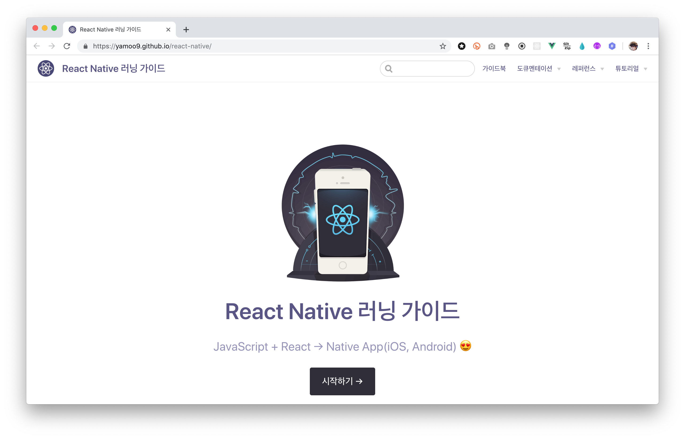
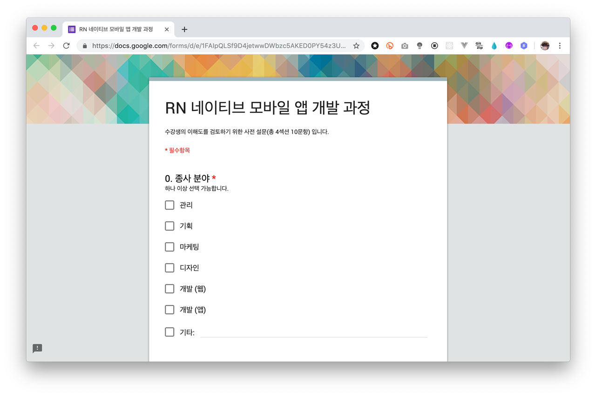

# React Native 러닝 가이드

JavaScript + React → Native App(iOS, Android) 😍

 

## 러닝 가이드북

학습 진행을 위한 React Native [E-Book](https://yamoo9.github.io/react-native/) 입니다.

## 레벨 테스트

[Rect Native 모바일 앱 개발 강의 - 사전 설문](https://forms.gle/yi1AhiXnQcTMJTB4A)은 React Native를 배울 준비가 되어 있는지 확인합니다.

## 실습 진행 순서

실습 진행을 위한 브랜치(branch) 입니다.

1. [Modern JavaScript](https://github.com/yamoo9/react-native/tree/js-env)
1. [React Library 01](https://github.com/yamoo9/react-native/tree/react-01)
1. [React Library 02](https://github.com/yamoo9/react-native/tree/react-02)
1. [React Library 03](https://github.com/yamoo9/react-native/tree/react-03)
1. [React Library 04](https://github.com/yamoo9/react-native/tree/react-04)
1. [React Library 05](https://github.com/yamoo9/react-native/tree/react-05)
1. [React Library 06](https://github.com/yamoo9/react-native/tree/react-06)
1. [Styled Components](https://github.com/yamoo9/react-native/tree/styled-components)
1. [Redux Library 01](https://github.com/yamoo9/react-native/tree/redux-01)
1. [Redux Library 02](https://github.com/yamoo9/react-native/tree/redux-02)
1. [React Native 01](https://github.com/yamoo9/react-native/tree/react-native-01)
1. [React Native 02](https://github.com/yamoo9/react-native/tree/react-native-02)
1. [React Native 03](https://github.com/yamoo9/react-native/tree/react-native-03)
1. [React Native 04](https://github.com/yamoo9/react-native/tree/react-native-04)
1. [React Native 05](https://github.com/yamoo9/react-native/tree/react-native-05)
1. [React Native 06](https://github.com/yamoo9/react-native/tree/react-native-06)