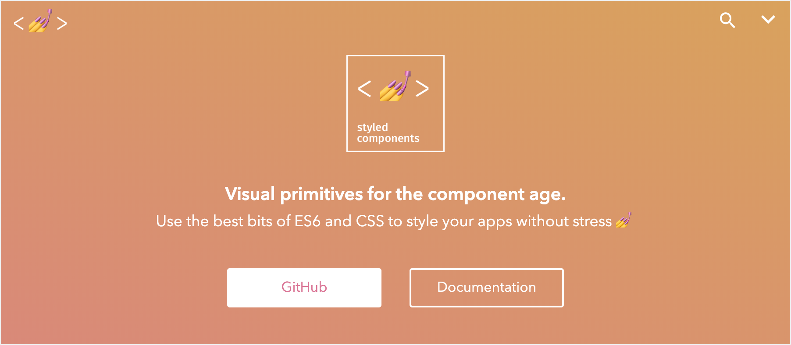
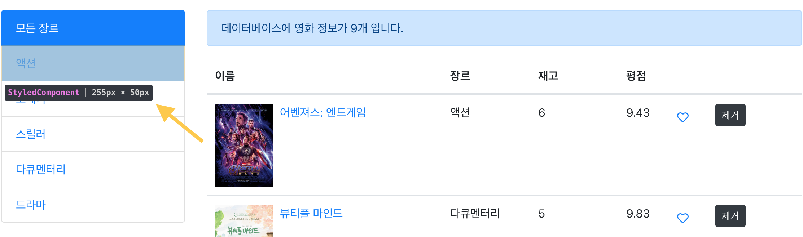
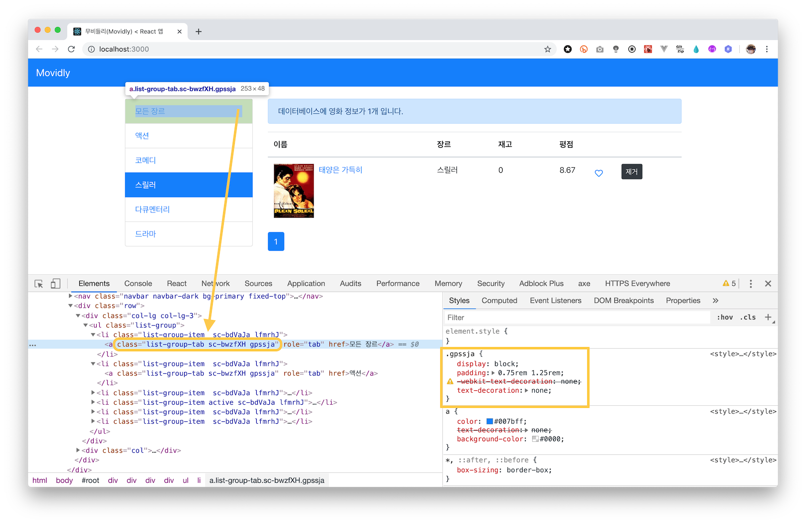

# React Native 러닝 가이드

JavaScript + React → Native App(iOS, Android) 😍

### 🤐 학습 자료

React 애플리케이션 학습 자료를 다운로드 받아 실습을 진행합니다.

➪ [학습 자료](https://github.com/yamoo9/react-native/archive/styled-components-start.zip) 다운로드

<br>

## Styled Components 라이브러리

[Styled Components](https://www.styled-components.com/) 라이브러리는 React 컴포넌트 시스템 구조에서 CSS를 보다 효율적으로 작성하기 위한 결과물입니다. Single Use Case에 중점을 두고 최종 사용자와 개발자를 위한 최적의 경험을 제공합니다.



### ✏ 학습

[Styled Components 러닝 가이드](https://yamoo9.github.io/react-native/guidebook/sc-gettring-started.html)를 참고하여 학습을 진행합니다.

1. 스타일 라이브러리
1. 기본 사용법
1. props 적용
1. 스타일 확장
1. 컴포넌트 스타일 확장
1. 컴포넌트 스타일 래퍼
1. 가상 클래스/요소, 중첩 규칙
1. 믹스인 (Mixin)
1. 애니메이션
1. 글로벌 스타일
1. 테마 (Theme)
1. React Native
1. 리소스

<br>

## ✏ 실습

Movidly > ListGroup 컴포넌트에 추가한 스타일링을 CSS 대신, styled-components 라이브러리를 활용해봅니다.



<br>

### 라이브러리 설치

styled-components 라이브러리를 프로젝트에 설치합니다.

```sh
$ yarn add styled-components
# 또는 npm i styled-components
```

### CSS 스타일링 제거

App.css에 추가했던 `.list-group-item`, `.list-group-tab` 스타일 코드를 주석 처리합니다.

```css
/*
.list-group-item {
  padding: 0;
}

.list-group-tab {
  display: block;
  padding: 0.75rem 1.25rem;
  text-decoration: none;
}
.list-group-tab:hover {
  text-decoration: inherit;
}

.active .list-group-tab {
  color: #fff;
}
*/
```

### ListGroup 컴포넌트 > Styled Components 활용

styled-components 모듈을 불러옵니다.

```jsx
import styled from 'styled-components'
```

먼저 ListGroupItem 스타일 컴포넌트를 만들고, CSS 패딩 값을 0으로 설정합니다.

```jsx
const ListGroupItem = styled.li`
  padding: 0;
`
```

이어서 ListGroupTab 스타일 컴포넌트를 만든 후 CSS 스타일링을 추가합니다.
그리고 중첩 규칙을 사용해 호버(hover) 상태, 상위 컴포넌트인 ListGroupItem의 활성화(active) 상태에서의 디자인을 설정합니다.

```jsx
const ListGroupTab = styled.a`
  display: block;
  padding: 0.75rem 1.25rem;
  text-decoration: none;

  :hover {
    text-decoration: inherit;
  }

  .active & {
    color: #fff;
  }
`
```

ListGroup 컴포넌트 JSX 코드에서 \<li\> 요소 대신 \<ListGroupItem\>, \<a\> 요소 대신 \<ListGroupTab\> 스타일 컴포넌트로 변경합니다.

```jsx
<ul className="list-group">
  {items.map((item, i) => (
    <ListGroupItem
      key={item[idProp]}
      className={`list-group-item ${activeClass(item)}`}
    >
      <ListGroupTab
        className="list-group-tab"
        role="tab"
        href=""
        onClick={e => onItemSelect(item, e)}>
        {item[contentProp]}
      </ListGroupTab>
    </ListGroupItem>
  ))}
</ul>
```


### 스타일 컴포넌트 렌더링 결과

Styled Components는 렌더링 될 때, DOM 요소에 고유한 class 속성 이름을 설정합니다. 스타일이 특정 컴포넌트에 묶여 있어, 컴포넌트를 사용하지 않을 경우 불 필요한 스타일 코드가 남아있지 않습니다. 즉, 사용된 컴포넌트 스타일 코드만 렌더링 과정에서 처리됩니다.


