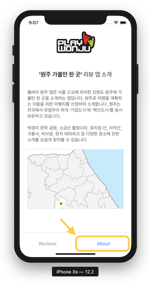

# React Native 러닝 가이드

JavaScript + React → Native App(iOS, Android) 😍

 

## WonjuReview 앱

'원주 리뷰 앱' 예제 코드를 추가했습니다. 코드를 참고하세요.

- 스플래시 이미지
- 아이콘
- 스크린 내비게이션 (with React Navigation)
  - 리뷰 리스트 스크린
  - 리뷰 스크린 (모달 스택)
  - 앱 소개 스크린
  - 하단 탭 메뉴 바
- 비동기 스토리지 활용

 

