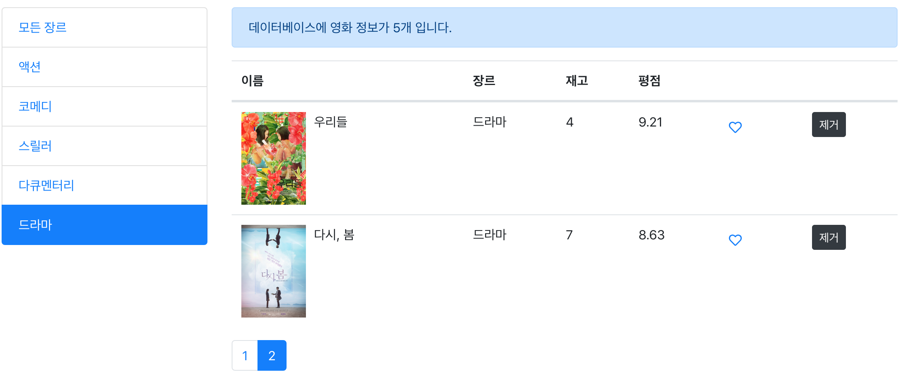
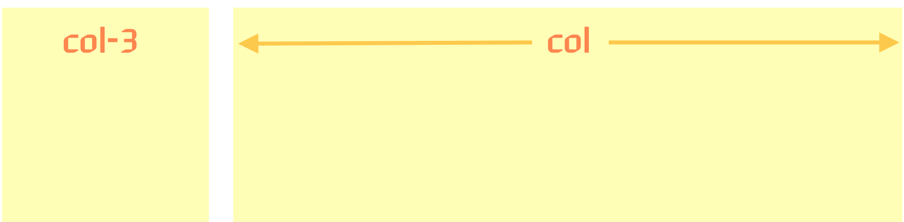
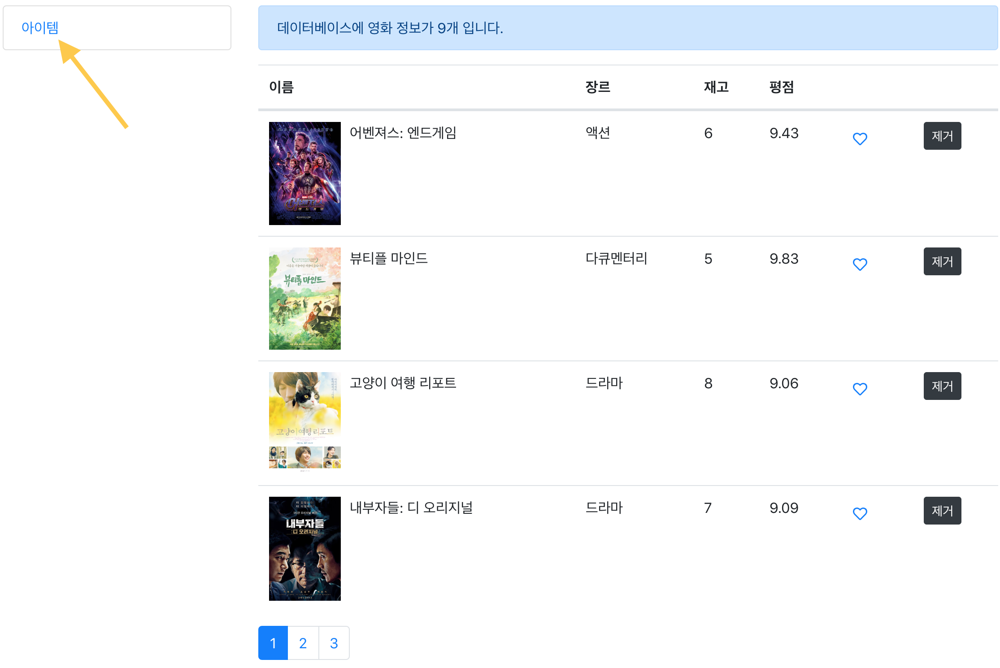
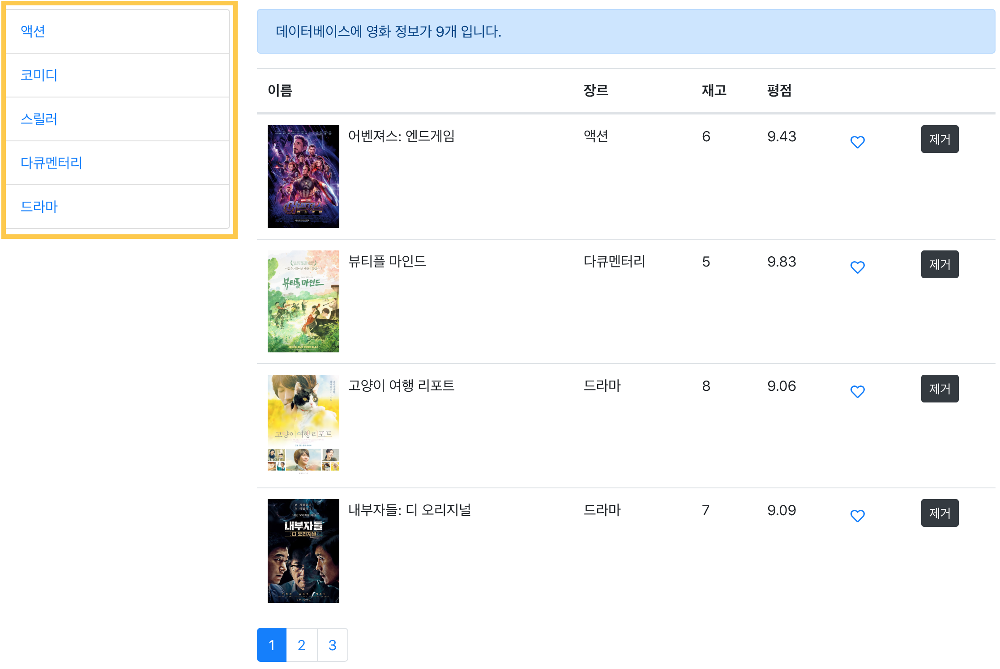
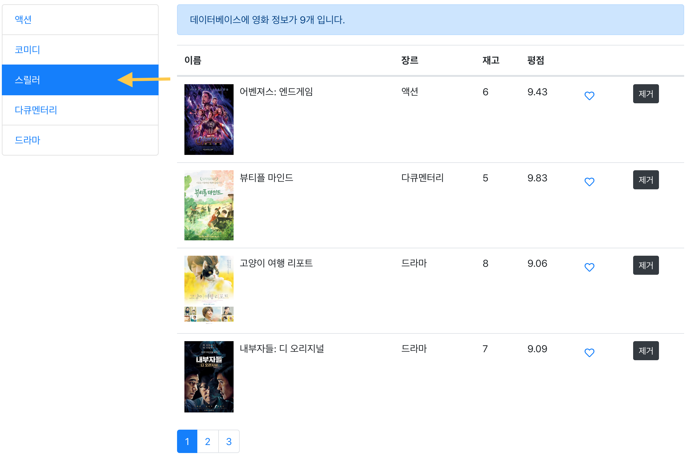
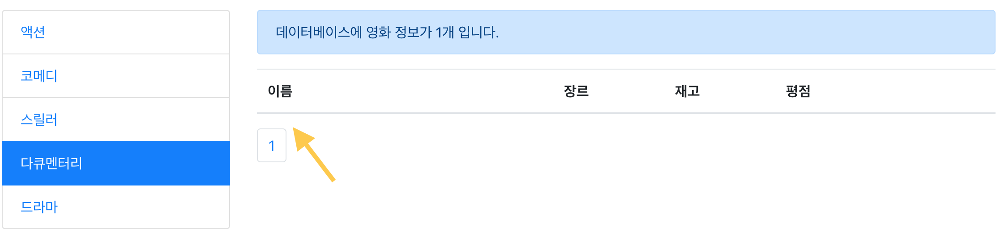

# React Native 러닝 가이드

JavaScript + React → Native App(iOS, Android) 😍

### 🤐 학습 자료

React 애플리케이션 학습 자료를 다운로드 받아 실습을 진행합니다.

➪ [학습 자료](https://github.com/yamoo9/react-native/archive/react-05-ex.zip) 다운로드

<br>

## ListGroup 컴포넌트

무비 콘텐츠를 장르별로 필터링 할 수 있도록 기능을 추가해봅니다.



<br>

### 컴포넌트 생성

ListGroup 컴포넌트를 생성한 후, [Bootstrap > ListGroup](https://getbootstrap.com/docs/4.3/components/list-group/) 가이드를 참고하여 리스트 그룹 구조를 작성합니다. 참고로 그룹 안의 각 아이템은 사용자가 클릭 가능한 요소여야 합니다. 그래서 가이드에는 없지만 클릭 가능한 \<a\> 요소를 추가한 후 탭(tab) 역할(role)을 부여하고, list-group-tab 클래스 속성을 추가합니다.

```jsx
// src/components/common/ListGroup.jsx

import React from 'react'

const ListGroup = props => {
  return (
    <ul className="list-group">
      <li className="list-group-item">
        <a role="tab" href="" className="list-group-tab">
          아이템
        </a>
      </li>
    </ul>
  )
}

export default ListGroup
```

App.css 파일을 열어 리스트 그룹 탭(list-group-tab) 디자인을 추가합니다.

```css
/* App.css */

.list-group-item {
  padding: 0;
}

.list-group-tab {
  display: block;
  padding: 0.75rem 1.25rem;
  text-decoration: none;
}
.list-group-tab:hover {
  text-decoration: inherit;
}

.active .list-group-tab {
  color: #fff;
}
```

Movies 컴포넌트에서 ListGroup 컴포넌트를 불러온 후, 구조 코드를 수정합니다. [Bootstrap > Grid system](https://getbootstrap.com/docs/4.3/layout/grid/)을 참고하여 레이아웃을 추가합니다. 왼쪽 컬럼에는 ListGroup 컴포넌트를, 반대쪽 컬럼에는 기존 구조 코드를 배치합니다.

```jsx
// src/components/Movies.jsx

import ListGroup from './common/ListGroup'

class Movies extends Component {
  render() {
    return (
      <div className="row">
        <div className="col-3">
          <ListGroup />
        </div>
        <div className="col">
          <p className="alert alert-primary" role="alert">
            ...
          </p>
          <table className="table">....</table>
          <Pagination />
        </div>
      </div>
    )
  }
}
```





<br>

### 컴포넌트 설계

ListGroup 컴포넌트는 다음의 속성을 전달 받아 처리합니다.

| 속성         | 설명                                            |
| ------------ | ----------------------------------------------- |
| items        | 장르 정보 아이템 집합                           |
| onItemSelect | 클릭 시, 아이템을 선택하는 커스텀 이벤트 핸들러 |

<br>

Movies 컴포넌트의 \<ListGroup \/> 요소에 각 속성을 추가하고, 필요한 상태 및 메서드를 추가합니다.

```jsx
// src/components/Movies.jsx

// genreService 모듈에서 getGenres() 함수 불러오기
import { getGenres } from '../services/genreService'

class Movies extends Component {
  state = {
    movies: [],
    genres: [],
    // ...
  }
  componentDidMount() {
    // 컴포넌트 마운트 된 시점에 상태 업데이트
    this.setState({
      genres: getGenres(),
    })
  }
  handleItemSelect = (genre, e) => {
    e.preventDefault()
    console.log(genre) // 사용자가 선택한 장르
  }
  render() {
    const { genres } = this.state

    return <ListGroup items={genres} onItemSelect={this.handleItemSelect} />
  }
}
```

이어서 ListGroup 컴포넌트에 전달 된 속성을 구조 분해 할당 처리한 후, 리스트 렌더링과 이벤트 핸들러를 연결하는 코드를 작성합니다.

```jsx
// src/components/common/ListGroup.jsx

const ListGroup = props => {
  // 전달받은 속성 구조 분해 할당
  const { items, onItemSelect } = props

  return (
    <ul className="list-group">
      {items.map(item => (
        <li key={item._id} className="list-group-item">
          <a
            style={styles}
            role="tab"
            href=""
            className="list-group-tab"
            onClick={e => onItemSelect(item, e)}>
            {item.name}
          </a>
        </li>
      ))}
    </ul>
  )
}
```



<br>

### 사용자 정의 속성 전달

ListGroup 컴포넌트는 재사용 가능한 공통 컴포넌트로 전달 받은 아이템의 특정 속성(`_id`, `name`)으로 제한하지 않고,
사용자가 속성 이름을 설정할 수 있도록 구성하는 것이 재활용 하기 좋습니다.

| 속성        | 설명                    |
| ----------- | ----------------------- |
| idProp      | 전달 받은 아이템 식별자 |
| contentProp | 전달 받은 아이템 콘텐츠 |

<br>

Movies 컴포넌트에 작성된 ListGroup 요소에 `idProp`, `contentProp` 속성을 추가한 후 값을 설정합니다.

```jsx
// src/components/Movies.jsx

<ListGroup items={genres} onItemSelect={this.handleItemSelect} idProp="_id" contentProp="name" />
```

ListGroup 컴포넌트에 전달된 속성 `idProp`, `contentProp` 속성을 `_id`, `name` 속성 대신
동적으로 할당 받도록 코드를 수정합니다.

```jsx
// src/components/common/ListGroup.jsx

const ListGroup = props => {
  // idProp, contentProp 속성을 전달 받음
  const { items, onItemSelect, idProp, contentProp } = props

  return (
    <ul className="list-group">
      {items.map(item => (
        <li key={item[idProp]} className="list-group-item">
          <a
            style={styles}
            role="tab"
            href=""
            className="list-group-tab"
            onClick={e => onItemSelect(item, e)}>
            {item[contentProp]}
          </a>
        </li>
      ))}
    </ul>
  )
}
```

### 전달 속성 기본 값

사용자가 임의로 속성을 설정하는 것이 재활용 측면에서는 좋지만, 사용자가 속성을 전달하지 않더라도 기본 값을 사용할 수 있도록 구성하는 것이 좋습니다. React는 [defaultProps](https://ko.reactjs.org/docs/react-component.html#defaultprops) 클래스 멤버를 사용해 전달될 속성의 기본 값을 설정할 수 있습니다.

```jsx
// src/components/common/ListGroup.jsx

const ListGroup = props => {
  // ...
}

ListGroup.defaultProps = {
  idProp: '_id',
  contentProp: 'name',
}
```

ListGroup 컴포넌트의 전달 속성 기본 값을 설정했으니 앞서 추가했던 `idProp`, `contentProp` 속성을 사용자가 설정하지 않으면 기본 값을 사용합니다.

```jsx
// src/components/Movies.jsx

<ListGroup items={genres} onItemSelect={this.handleItemSelect} />
```

### 선택된 장르 활성화

사용자가 선택한 장르(`selectedGenre`)을 활성화(active)하는 상태 업데이트 코드를 `handleItemSelect()` 메서드에 작성합니다.
그리고 ListGroup 컴포넌트에 `selectedItem` 속성을 추가한 후 선택된 장르를 값으로 설정합니다.

| 속성         | 설명                         |
| ------------ | ---------------------------- |
| selectedItem | 사용자에 의해 선택 된 아이템 |

```jsx
// src/components/Movies.jsx

handleItemSelect = (genre, e) => {
  e.preventDefault()
  this.setState({
    selectedGenre: genre,
  })
}

render() {
  const { selectedGenre } = this.state

  return (
    <div className="row">
      <div className="col-3">
        <ListGroup items={genres} seletedItem={selectedGenre} onItemSelect={this.handleItemSelect} />
      </div>
      <div className="col">...</div>
    </div>
  )
}
```

활성화 클래스 `active`를 사용자가 선택한 리스트 그룹 아이템 요소(li)에
설정되도록 `activeClass()` 함수를 작성해 클래스 속성으로 연결합니다.

```jsx
// src/components/common/ListGroup.jsx

const ListGroup = props => {
  const { selectedItem } = props

  const activeClass = item => {
    return selectedItem === item ? 'list-group-item active' : 'list-group-item'
  }

  return (
    <ul className="list-group">
      {items.map(item => (
        <li key={item[idProp]} className={activeClass(item)}>
          ...
        </li>
      ))}
    </ul>
  )
}
```



<br>

### 선택된 장르 필터링

선택된 장르가 있을 경우와 그렇지 않은 경우로 구분해 무비 데이터를 필터링 하도록 코드를 작성합니다.
필터링된 무비는 `paginate()` 함수의 첫번째 인자로 전달합니다.

```jsx
// src/components/Movies.jsx
render() {
  // ...
  const filteredMovies = selectedGenre
    ? allMovies.filter(m => m.genre._id === selectedGenre._id)
    : allMovies

  const movies = paginate(filteredMovies, currentPage, pageSize)
  // ...
}
```

그리고 기존의 `count`를 사용했던 코드 부분을 `filteredMovies.length`로 모두 변경합니다.
필터링 된 무비의 개수를 화면에 정상적으로 출력하기 위함입니다.

```jsx
<p className="alert alert-primary" role="alert">
  데이터베이스에 존재하는 영화 정보는 <b>{filteredMovies.length}</b>개 입니다.
</p>

<Pagination
  itemsCount={filteredMovies.length}
  currentPage={currentPage}
  pageSize={pageSize}
  onPageChange={this.handlePageChange} />
```

### 필터링 시, 문제 해결

필터링 기능을 테스트 하다보면 문제를 마주하게 됩니다. 화면에 아이템이 출력되지 않는 현상이 발생합니다.



<br>

이유는 페이지네이션 링크가 1개 뿐인 필터링 아이템은 다른 페이지네이션 링크 (예: 2, 3, ...)가 선택된 상태에서
필터링 되었을 때 현재 페이지(currentPage) 값이 1이 아니기 때문에 화면에 보여지지 않는 것입니다.
이 문제를 개선하려면 `handleItemSelect()` 메서드에서 `currentPage` 상태를 `1`로 업데이트 합니다.

```jsx
handleItemSelect = (genre, e) => {
  e.preventDefault()
  this.setState({
    currentPage: 1,
    selectedGenre: genre,
  })
}
```

### 모든 장르 선택

현재 장르를 필터링 하는 탭을 선택한 후, 다시 '모든 장르'로 변경하는 기능은 없습니다. 이 기능을 추가해봅니다.
컴포넌트 마운트 시점에 모든 장르 선택에 해당하는 객체를 정의한 후, `genres` 배열 데이터에 병합합니다.
그리고 페이지 초기 로드 시 선택된 장르를 '모든 장르'로 설정합니다.

```jsx
componentDidMount() {
  const allGenre = { name: '모든 장르', _id: '*' }
  const genres = [allGenre, ...getGenres()]
  this.setState({
    movies: getMovies(),
    selectedGenre: genres[0],
    genres,
  })
}
```
