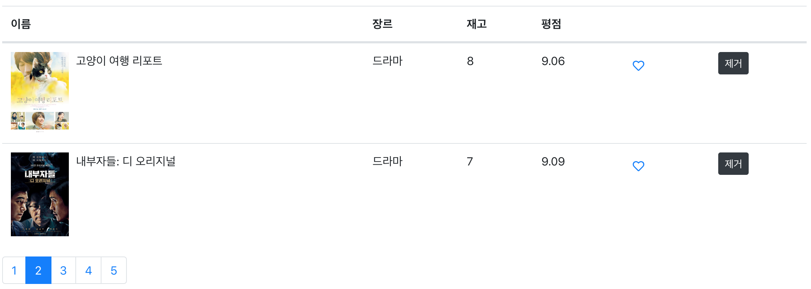
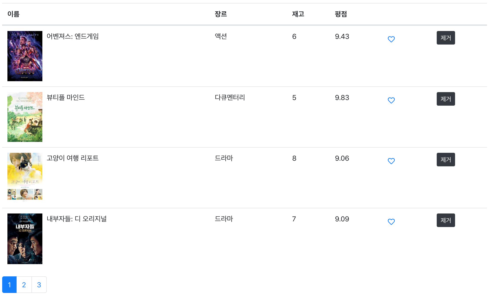
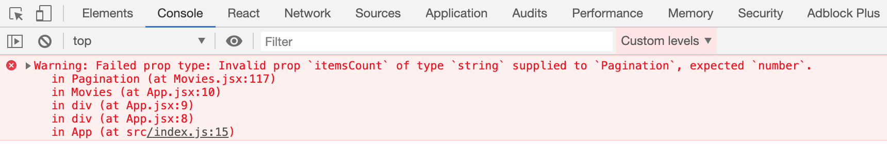

# React Native 러닝 가이드

JavaScript + React → Native App(iOS, Android) 😍

### 🤐 학습 자료

React 애플리케이션 학습 자료를 다운로드 받아 실습을 진행합니다.

➪ [학습 자료](https://github.com/yamoo9/react-native/archive/react-04-ex.zip) 다운로드

<br>

## Pagination 컴포넌트

무비 데이터베이스가 많아질 경우, UI에 페이지네이션이 추기되도록 구성해보겠습니다.


### 컴포넌트 생성

Pagination 컴포넌트를 생성한 후, [Bootstrap > Pagination](https://getbootstrap.com/docs/4.3/components/pagination/) 가이드를 참고하여 페이지네이션 구조를 작성합니다.

```jsx
// src/components/common/Pagination.jsx

import React from 'react'

const Pagination = props => {
  return (
    <nav>
      <ul className="pagination">
        <li className="page-item">
          <a href="" className="page-link">
            페이지 번호
          </a>
        </li>
      </ul>
    </nav>
  )
}

export default Pagination
```

```jsx
// src/components/Movies.jsx

import Pagination from './common/Pagination'

class Movies extends Component {
  render() {
    return <Pagination />
  }
}
```

### 컴포넌트 설계

Pagination 컴포넌트는 다음의 속성을 전달 받아 처리합니다.

| 속성         | 설명                                          |
| ------------ | --------------------------------------------- |
| itemsCount   | 무비 정보 아이템의 총 개수                         |
| pageSize     | 한 화면에 보여 줄 페이지 개수                  |
| currentPage  | 현재 페이지 번호                              |
| onPageChange | 클릭 시, 페이지를 변경할 커스텀 이벤트 핸들러(메서드) |

<br>

Movies 컴포넌트의 \<Pagination \/> 요소에 각 속성을 추가하고, 필요한 상태 및 메서드를 추가합니다.

```jsx
// src/components/Movies.jsx

class Movies extends Component {
  state = {
    movies: [],
    currentPage: 1,
    pageSize: 3,
  }
  handlePageChange = (page, e) => {
    e.preventDefault()
    console.log(page) // 사용자가 클릭한 페이지 번호
  }
  render() {
    const { currentPage, pageSize } = this.state
    const { length: count } = this.state.movies
    return (
      <Pagination
        // 무비 정보 총 개수
        itemsCount={count}
        // 화면에 보여질 개수
        pageSize={pageSize}
        // 현재 페이지 번호
        currentPage={currentPage}
        // 클릭 이벤트에 연결할 메서드
        onPageChange={this.handlePageChange}
      />
    )
  }
}
```

### 페이지네이션 개수

이어서 Pagination 컴포넌트에 전달된 속성을 처리합니다. Pagination 컴포넌트는 전달된 속성을 통해 화면에 출력할 페이지 개수를 계산해야 합니다.


#### Lodash 라이브러리 활용

손쉬운 배열 데이터 관리를 위해 [Lodash](https://lodash.com/) 라이브러리를 설치합니다.

```sh
$ yarn add lodash
```

전달 받은 속성을 계산하여 페이지네이션 개수(pageCount)를 구합니다.

> **페이지네이션 개수 설정**<br>
> —————————————————————————————<br>
> 페이지네이션 개수 = 올림(총 아이템 개수 ÷ 화면에 출력할 페이지 개수)<br>
> 총 9개를 3개씩 보여주면? `9 ÷ 3 = 3`<br>
> 총 9개를 5개씩 보여주면? `9 ÷ 5 = 올림(1.8) = 2`<br>
> `const pageCount = Math.ceil(itemCount / pageSize)`

### 페이지 링크 배열

페이지네이션 개수를 구한 후, [\_.range()](https://lodash.com/docs/4.17.11#range) 메서드를 활용해 pages 배열을 생성하여 리스트 렌더링 처리합니다.

> **페이지 링크 배열 설정**<br>
> —————————————————————————————<br>
> 총 9개를 3개씩 보여주면? `[1,2,3]`<br>
> 총 9개를 5개씩 보여주면? `[1,2,3,4,5]`<br>
> `const pages = _.range(1, pageCount + 1)`

<br>

Pagination 컴포넌트에 페이지네이션 개수, 페이지 링크 배열 생성 코드를 반영합니다.

```jsx
// src/components/common/Pagination.jsx

import _ from 'lodash'

const Pagination = props => {
  const { itemsCount, currentPage, pageSize, onPageChange } = props
  // 페이지네이션 개수 = 올림(총 아이템 개수 ÷ 화면에 출력할 페이지 개수)
  // 예: 9 ÷ 10 = 0.9 => 올림 => 1
  // 예: 9 ÷ 4 = 2.25 => 올림 => 3
  const pageCount = Math.ceil(itemsCount / pageSize)
  // Lodash 라이브러리 range() 메서드를 사용해 [1, 2, ..., pageCount + 1] 배열 생성
  const pages = _.range(1, pageCount + 1)

  return (
    <nav>
      <ul className="pagination">
        {/* pages 페이지 링크 배열 리스트 렌더링 */}
        {pages.map(page => (
          <li key={page} className="page-item">
            <a
              href=""
              className="page-link"
              // 클릭 이벤트(페이지 번호 전달)
              onClick={e => onPageChange(page, e)}>
              {page}
            </a>
          </li>
        ))}
      </ul>
    </nav>
  )
}
```

### 현재 페이지 & 활성화 클래스

사용자가 클릭한 페이지 번호를 현재 페이지(활성화 페이지)로 상태 업데이트 되도록 `handlePageChange()` 메서드 코드를 작성합니다.

```jsx
// src/components/Movies.jsx

handlePageChange = (page, e) => {
  e.preventDefault()
  // 사용자가 클릭한 페이지 번호를
  // 현재 페이지 번호로 상태 업데이트
  this.setState({
    currentPage: page,
  })
}
```

활성화 클래스 `active`를 사용자가 클릭한 현재 페이지 번호에 추가되도록 코드를 작성합니다.

```jsx
// src/components/common/Pagination.jsx

const Pagination = props => {
  // ...

  function activeClass(page) {
    return page === currentPage ? 'page-item active' : 'page-item'
  }

  return (
    <nav>
      <ul className="pagination">
        {pages.map(page => (
          <li key={page} className={activeClass(page)}>
            <a
              href=""
              role="tab"
              className="page-link"
              onClick={e => onPageChange(page, e)}>
              {page}
            </a>
          </li>
        ))}
      </ul>
    </nav>
  )
}
```

<br>

### 페이지 필터링

화면에 보여 줄 개수만큼 영화 정보 리스트를 필터링 설정해봅니다.



### paginate 유틸리티

한 화면에 보여질 페이지 개수를 처리하는 `paginate()` 유틸리티 함수를 작성합니다.
`paginate()` 함수는 다음의 매개변수를 전달 받습니다. `paginate(items, pageNumber, pageSize)`

| 매개변수   | 설명                         |
| ---------- | ---------------------------- |
| items      | 아이템 리스트(배열)                  |
| pageNumber | 현재 페이지 번호             |
| pageSize   | 한 화면에 뿌려질 페이지 개수 |

<br>

> **아이템 리스트 필터링 & 시작 인덱스 설정**<br>
> ———————————————————————————————————<br>
> 총 9개를 1페이지에서 3개씩 보여주면? (1 - 1) × 3 = 0 ➪ `[{id:1, ...},{id:2, ...},{id:3, ...}]`<br>
> 총 9개를 2페이지에서 3개씩 보여주면? (2 - 1) × 3 = 3 ➪  `[{id:4, ...},{id:5, ...},{id:6, ...}]`<br>
> 보여 줄 아이템의 시작 번호 = (현재 페이지 번호 - 1) * 보여 줄 아이템 개수<br>
> `const startIndex = (pageNumber - 1) * pageSize`

<br>

현재 페이지 번호의 시작 인덱스부터 한 화면에 보여질 페이지 개수 만큼
데이터를 계산하여 반환하기 위해 Lodash 라이브러리의 [\_.slice()](https://lodash.com/docs/4.17.11#slice), [\_.take()](https://lodash.com/docs/4.17.11#take) 메서드를 사용합니다.

| 메서드     | 설명                                                          |
| ---------- | ------------------------------------------------------------- |
| \_.slice() | 배열 데이터 중 일부를 잘라 새로운 배열을 반환합니다.          |
| \_.take()  | 배열 데이터 중 전달된 개수만큼 잘라 새로운 배열을 반환합니다. |


<br>

> **※ 참고: Lodash 라이브러리 메서드 대신 `.slice` 메서드를 사용해도 무방합니다.**<br>
>
> ```js
> // Lodash
> _(아이템_배열).slice(시작_인덱스).take(보여질_페이지_개수).value()
>
> // ⬇︎
>
> // Array.prototype.slice
> 아이템_배열.slice(시작_인덱스, (시작_인덱스 + 보여질_페이지_개수))
>
> // 예시
> const list = [1, 2, 3, 4, 5, 6]
> let pageSize = 3
> let currentPage = 2
> let startIndex = (currentPage - 1) * pageSize // 3
> list.slice(startIndex, startIndex + pageSize) // 3 ~ 6
> // 결과: [4, 5, 6]
> ```

<br>

먼저 시작 인덱스는 페이지 번호에서 1을 뺀 후, 한 화면에 보여질 페이지 개수를 곱해 계산합니다.

```js
// src/utils/paginate.js

import _ from 'lodash'

export const paginate = (items, pageNumber, pageSize) => {
  // 예: (1 - 1) * 3 => 0
  // 예: (2 - 1) * 3 => 3
  const startIndex = (pageNumber - 1) * pageSize

  // _() 함수에 데이터를 전달하면 Lodash 인스턴스를 반환해 메서드 체이닝이 가능
  return _(items)
    .slice(startIndex) // 시작 인덱스 부터
    .take(pageSize) // 한 화면에 보여질 페이지 개수 만큼 필터링 한 후
    .value() // 값을 반환
}
```

### Movies 컴포넌트 > 화면에 보여질 아이템 처리

현재 페이지 번호를 시작으로 하여 페이지 개수 만큼 화면에 그리기 위해
`paginate()` 유틸리 함수를 불러온 후 계산된 값을 `movies` 상수에 할당 받아 처리되도록 코드를 작성합니다.

```jsx
// src/components/Movies.jsx

// paginate() 유틸리티 함수 불러오기
import { paginate } from '../utils/paginate'

class Movies extends Component {
  // ...
  render() {
    // this.state.movie 구조 분해 할당 (이름 allMovies로 변경)
    const { currentPage, pageSize, movies: allMovies } = this.state
    const { length: count } = this.state.movies
    // paginate() 유틸리티 함수를 사용해 한 화면에 뿌려질 무비 데이터 필터링
    const movies = paginate(allMovies, currentPage, pageSize)

    return (
      // ...
      <tbody>
        {movies.map(movie => (
          <tr key={movie._id}>...</tr>
        )}
      </tbody>
    )
  }
}
```



### 전달 속성 유효성 검사

작성된 페이지네이션은 화면에 잘 그려지지만, Pagination 컴포넌트에 전달되는 속성의 유형이 잘못 되었다 하더라도
React 애플리케이션은 오류를 알려주지 않습니다. React는 이러한 문제를 해결하기 위한 솔루션으로 [prop-types](https://www.npmjs.com/package/prop-types) 모듈을 별도 제공합니다. 먼저 해당 모듈을 설치합니다.

```sh
$ yarn add prop-types
```

Pagination 컴포넌트에 전달되는 속성 유형을 올바른지 검사하는 코드를 작성합니다.

```jsx
// src/components/common/Pagination.jsx

// PropTypes 모듈 불러오기
import PropTypes from 'prop-types'

const Pagination = props => {
  // ...
}

// Pagination 컴포넌트에 전달되는 속성(props) 유효성 검사 설정
Pagination.propTypes = {
  itemsCount: PropTypes.number.isRequired,
  currentPage: PropTypes.number.isRequired,
  pageSize: PropTypes.number.isRequired,
  onPageChange: PropTypes.func.isRequired,
}
```

### 오류 감지 및 알림

전달될 속성 유형을 잘못 전달한 경우를 임의로 구성해 오류를 출력하는지 확인해봅니다.

```jsx
<Pagination
  itemsCount={count}
  currentPage={currentPage}
  pageSize="pageSize"
  onPageChange={this.handlePageChange}
/>
```

브라우저 Console 패널에 출력되는 오류 메시지를 살펴보면 전달된 속성의 타입에 문제가 있음을 알려줍니다.



<!-- ```
Warning: Failed prop type: Invalid prop `pageSize` of type `string` supplied to `Pagination`, expected `number`.
    in Pagination (at Movies.jsx:99)
    in Movies (at App.jsx:9)
    in main (at App.jsx:8)
    in App (at src/index.js:16)
``` -->
